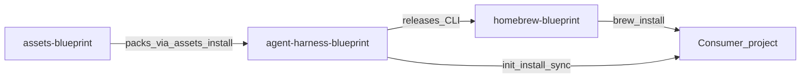
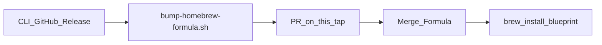

# homebrew-blueprint

Homebrew tap for the Blueprint CLI.

Sibling repos: [`agent-harness-blueprint`](https://github.com/krerapus/agent-harness-blueprint) (CLI builds + releases) · [`assets-blueprint`](https://github.com/krerapus/assets-blueprint) (static packs).

**This repository is not the source of truth for CLI builds.** Binaries/archives are produced by [`krerapus/agent-harness-blueprint`](https://github.com/krerapus/agent-harness-blueprint) GitHub Releases. This tap only stores `Formula/blueprint.rb`.

---

## How it works



Formula bump flow:



| Piece | Role |
|-------|------|
| `Formula/blueprint.rb` | Version, per-platform `url` + `sha256`, libexec install |
| CLI release assets | `blueprint_<VER>_<os>_<arch>.tar.gz` on `agent-harness-blueprint` |
| Tap name | `krerapus/blueprint` (GitHub repo: `homebrew-blueprint`) |

The Formula installs the **full** release tree under `libexec` and exposes `bin/blueprint`. Installing only the script breaks `source lib/blueprint/*.sh`.

## How to use

Tap name is `krerapus/blueprint` (GitHub repo `homebrew-blueprint`). Homebrew resolves the short tap to `https://github.com/krerapus/homebrew-blueprint`.

```bash
# Short form (preferred) — or pass the URL explicitly if you prefer
brew tap krerapus/blueprint
# brew tap krerapus/blueprint https://github.com/krerapus/homebrew-blueprint

# Homebrew 6+ (including 7): trust third-party formulae once before install
brew trust --formula krerapus/blueprint/blueprint

brew install krerapus/blueprint/blueprint
blueprint --version

# Packs are not bottled in the Formula — install after first setup
blueprint assets install core
blueprint assets list
```

The Formula caveats print the same pack reminder (`assets install core` / `assets list`). Config lives under `~/.config/blueprint/`; pack cache under `~/.cache/blueprint/assets/`.

Upgrade:

```bash
brew update
brew upgrade krerapus/blueprint/blueprint
```

Uninstall (optional):

```bash
brew uninstall blueprint
# brew untap krerapus/blueprint   # only if you also want to remove the tap
```

After install, packs still come from [`assets-blueprint`](https://github.com/krerapus/assets-blueprint) via `blueprint assets …`. For CLI checkout / sibling-pack testing, see `docs/local-development.md` in [`agent-harness-blueprint`](https://github.com/krerapus/agent-harness-blueprint).

## How to update source

Prefer the automatic path: after each CLI tag `vX.Y.Z`, the CLI release workflow opens a PR here that rewrites `version`, `url`, and `sha256`.

Manual bump (from a CLI checkout that has `dist/` or downloaded checksums):

```bash
# In agent-harness-blueprint:
./scripts/bump-homebrew-formula.sh X.Y.Z dist ../homebrew-blueprint/Formula/blueprint.rb
ruby -c ../homebrew-blueprint/Formula/blueprint.rb
```

Then open a PR on this repo. Never invent SHA256 values; never leave `0000…0000` placeholders in a published Formula.

Do **not** vendor CLI source, `lib/`, or asset packs into this repository.

CLI docs: [`docs/homebrew.md`](https://github.com/krerapus/agent-harness-blueprint/blob/master/docs/homebrew.md).

## Contributing

See [CONTRIBUTING.md](CONTRIBUTING.md) for setup, branch/commit/PR conventions, and verification steps.

## Layout

```text
homebrew-blueprint/
├── Formula/
│   └── blueprint.rb
└── .github/workflows/
    └── formula-audit.yml
```

## License

Formula metadata for the MIT-licensed Blueprint CLI. See the CLI [LICENSE](https://github.com/krerapus/agent-harness-blueprint/blob/master/LICENSE).
